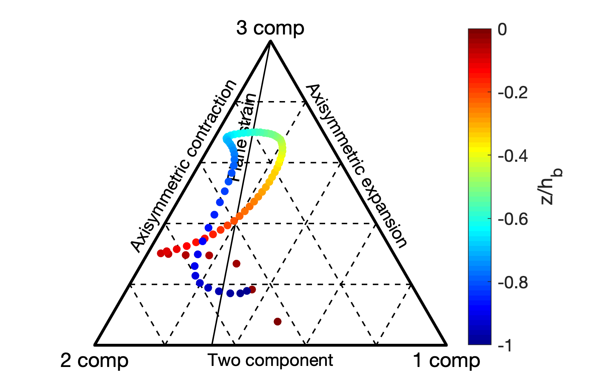
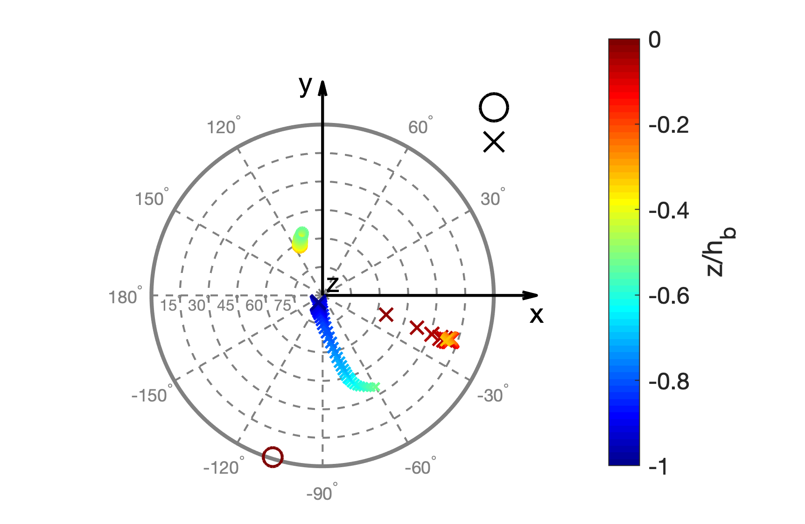

# Anisotropic barycentric map

MATLAB code to visualize the anisotropy of turbulence using the anisotropic barycentric map following [Banerjee et al, 2007](https://doi.org/10.1080/14685240701506896) and the direction of anisotropy map.

## Example
`example.m` is an example to visualize the anisotropy of Langmuir turbulence as a function of normalized depth using these tools. It reads in the Reynolds stress profiles generated by a large eddy simulation of Langmuir turbulence and plot them on the anisotropic barycentric map ([Figure 1](#Figure-1:-Anisotropic-barycentric-map)) and the corresponding direction of anisotropy ([Figure 2](Figure-2:-Direction-of-anisotropy)).

### Figure 1: Anisotropic barycentric map
Anisotropic barycentric map as a function of normalized depth. The closer a point is to the three vertices labeled by 1 comp, 2 comp and 3 comp, the closer the turbulence structure is to cigar-like, pancake-like and isotropic, respectively.

### Figure 2: Direction of anisotropy
Direction of anisotropy as a function of normalized depth. The direction of major axis (greatest eigenvalue) is marked by circles for cigar-like structure, whereas the direction of minor axis (smallest eigenvalue) is marked by crosses for pancake-like structure. The size of the markers is proportional to the degree of anisotropy. Black circle and cross in the upper left corner show the sizes corresponding to pure one-component and two-component turbulence. Three-component (isotropic) turbulence vanishes in this plot.

